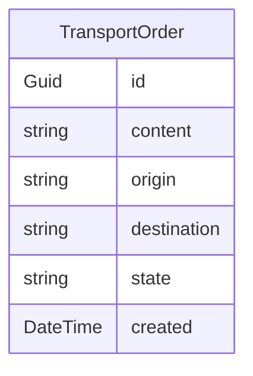

# loge

# Introduction

.NET solution to showcase sample REST and gPRC endpoints for sending and consuming TransportOrders.

A "Transport Order" is an order of content transport from A to B with a given state indicating where the transport process is at.

The aim is to provide the enduser REST endpoints to create a TransportOrder, consume the state of TransportOrder and view historical TransportOrders.

# TechStack

* .NET 8
* Domain-Driven-Design
* Clean Architecture
* Unit of Work
* Repository Pattern
* SQLite
* gRPC
* REST
* WebAPI
* EF Core

# Setup

1. Clone the solution
2. Restore nuget packages
3. Setup and Migrate the database: "dotnet ef database update"
4. Run "Loge.WebApi" and see a swagger page

# Project Structure

## Loge.Application.Contracts
Contains DTOs and Mapping with Domain Entities from Loge.Domain
This layer injects Loge.Domain.

## Loge.Application
Contains Application Services which are consumed by Loge.WebApi.
This layer injects Loge.Domain.

## Loge.Domain
Contains repository interfaces and domain entities

## Loge.Infrastructure
Contains EF Core implementation with DBContext, Code-First migrations and repository implementations
This layer injects Loge.Domain.

## Loge.WebApi
.NET WebApi with API Controllers consuming services from Loge.Application and using DTO's from Loge.Application.Contracts

## Loge.Grpc (Unfinished)
.NET Grpc API consuming services from Loge.Application and using DTO's from Loge.Application.Contracts. 

# Architecture

## SOLID Principles
Striving to follow the SOLID Principles with Separation of Concerns, Dependency Injection, Single Responsibility etc.

## Clean Architecture
The solution is based on "Clean Architecture" which is a pattern created by Robert C. Martin "Uncle Bob".
"It promotes a clear separation of concerns by dividing the application into concentric layers, with each layer having its responsibilities and dependencies. The fundamental principle behind Clean Architecture is the Dependency Rule, which states that dependencies should always point inward toward the more stable and abstract layers, rather than outward to more concrete and volatile layers."

## Domain Driven Design
Design pattern to model the business domain in code.

## Unit of Work
A design pattern by Martin Fowler related to effective implementation of the Repository Pattern.
Unit of Work can best be described as handling actions as a single transaction that involves multiple operations of insert/update/delete among others.

## Repository Pattern
A repository is merely a class that defines the data operations for a specific entity.
Given we have a "TransportOrder" entity, we would have a "TransportOrder" repository, handling every data operation for the entity.

## gRPC
Google Protobuf - Remote Procedure Call
RPC is like WCF, but uses Protobuf's binary protocol to transfer data, limiting the data overhead.
It is multi-platform

# Additional thoughts
The TransportOrder, which is an entity that would have it's state and perhaps content changed when being processed,
would be an ideal candidate for Event Sourcing architectural pattern.

Event Sourcing is a architectural pattern that saves historical changes to an entity as append-only, and thus does not change the actual entity,
which an regular DB update would do. Instead it applies another row with the decired change.

And since an TransportOrder is something that can change from "New"->"InProcess"->"Delivered", then these states would be applied as new rows in the DB.

Another approach would be to have a separate TransportOrderState table indicating the state changes a TransportOrder faces when being processed, for a historical overview.

# Notes
Unit Tests and Integration Tests have not been applied due to limited time.
So my main focus was to get a working solution for the case scenario.

Behavior Driven Development and Test Driven Development would be an ideal approach to develop this to be as robust and tested as possible.

When then consuming the entity, all the rows are consumed and combined and the entity is formed this way by applying all the "events" ("transactions").

https://learn.microsoft.com/en-us/azure/architecture/patterns/event-sourcing
